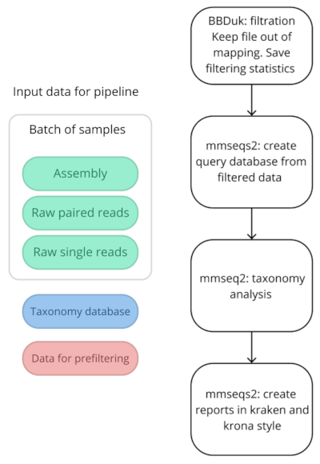
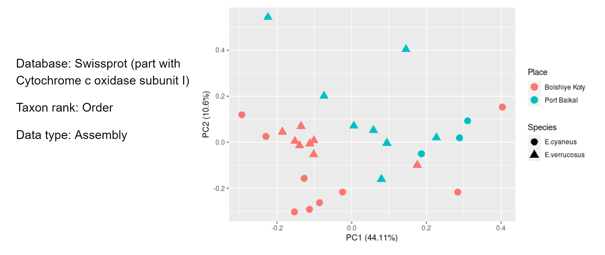

# Pipelines for metatranscriptome analysis of endemic Lake Baikal amphipod microbiome


## Project description

Metazoans are the habitat for ecological communities of symbiotic, parasitic and commensal epibiont microorganisms. The composition of these communities can be determined by many factors. 

It was shown that Baikal amphipods form a habitat for a variety of microorganisms, for example, ciliates, that we researched in a [previous spring project](https://github.com/julie-tooi/baikal_amphipod).

Metatranscriptome sequencing of two amphipod species (*Eulimnogammarus verrucosus* and *E. cyaneus*) from different sampling points in Lake Baikal (Port Baikal and Bolshie Koty) was carried out.

We tried to answer the question of what is the most important for microbiome composition: the place or species of the amphipod host?

## Goal and tasks

The main goal of the project is to answer the question below. This is really interesting, is't it? c:

The tasks:

- Make plan and design a pipeline to be flexible in order to use it for other tasks too in the future. Choose a way of implementation
- Write a pipeline
- Try the pipeline on test data
- Try the pipeline on real data
- Take a first look on the data


## Methods

Pipeline is written in [CWL](https://www.commonwl.org/v1.1/). Every tool used has [docker](https://www.docker.com/) container.

Scheme of steps in k-mer based pipelines (now data prefiltering is optional):



## Requirements

python ≥ 3.6

docker ≥ 19.0

cwltool ≥ 3.0

## Instruction to run pipeline

### Before start

You need to build a docker image for BBDuk.

For example, clone this repository, go to `bbduk` directory and build image:

```bash
git clone https://github.com/julie-tooi/baikal_amphipod_pipelines.git 
cd baikal_amphipod_pipelines/k-mer_based_pipelines/bbduk
docker build -t bbduk:test .
```

### Start pipeline

To start analysis you need to specify these parameters:

```bash
usage: run_pipelines.py [-h] -i SAMPLES -db DATABASE -c CONTAMINATION -type {1,2} -p PATTERN [-t THREADS]

optional arguments:
  -h, --help            show this help message and exit
  -i SAMPLES, --samples SAMPLES
                        Path to samples batch
  -db DATABASE, --database DATABASE
                        Path to ready-to-work mmseqs2 reference database
  -c CONTAMINATION, --contamination CONTAMINATION
                        Path to file with contamination data in fasta format
  -type {1,2}, --input_type {1,2}
                        Specify input type: 
			1 - give only one file for analysis (assembly) 
			2 - give two files for analysis (forward and reverse reads)
  -p PATTERN, --pattern PATTERN
                        Pattern that used to split sample name
			For example, file name is: 
			"/path/to/file/sample_1_rnasades_assembly.fasta"
			To get file name, we need split it by pattern "_rnaspades_"
  -t THREADS, --threads THREADS
```

Example command, where we use the assemblies for analysis:

```bash
python3 run_pipelines.py -i '/path/to/batch/data/*' -db /path/to/mmseqs_database/exapmle/swisssprot -c /path/to/filtering/file/contaminant.fasta -type 1 -t 6
```

### Processing reports

After pipeline finish, we have a several number of directories named after samples with three files inside: kraken and krona reports and filtering statistics.

To create a batch of kraken reports with sample names (for analyze in, for example, `pavian` R package), run script `collect_stats.py` with specifying path to folders with reports.

```bash
usage: stats_collector.py [-h] -f FOLDERS -o OUTPUT

optional arguments:
  -h, --help            show this help message and exit
  -f FOLDERS, --folders FOLDERS
                        Path to folders with reports
  -o OUTPUT, --output OUTPUT
                        Path to reports output
```

## Results

The first results were obtained using a whole Swissprot database with sensitivity parameter of `mmseqs2 taxonomy` equal 7.5. Results turned out to be kind of unexpected c:

For further analysis a part of the database (Swissprot) with marker protein COI (Cytochrome Oxidase I) was created. This type of analysis is more specific, next we tried to change some parameters in `mmseqs2 taxonomy` analysis to get the best results (sensitivity is 7.5, with exact-kmer-matching is true and min-ungapped-score is 30).

The PCA analysis of pipeline output data showed that the amphipods' living place is more important for microbiome composition than the species of amphipod.



## References

1. Peter Amstutz, Michael R. Crusoe, Nebojša Tijanić (editors), Brad Chapman, John Chilton, Michael Heuer, Andrey Kartashov, Dan Leehr, Hervé Ménager, Maya Nedeljkovich, Matt Scales, Stian Soiland-Reyes, Luka Stojanovic (2016): Common Workflow Language, v1.0. Specification, Common Workflow Language working group. https://w3id.org/cwl/v1.0/ doi:10.6084/m9.figshare.3115156.v2 
2. BBMap – Bushnell B. – sourceforge.net/projects/bbmap/
3. Bushmanova E, Antipov D, Lapidus A, Prjibelski AD. rnaSPAdes: a de novo transcriptome assembler and its application to RNA-Seq data. Gigascience. 2019;8(9):giz100. doi:10.1093/gigascience/giz100
4. Steinegger M and Soeding J. MMseqs2 enables sensitive protein sequence searching for the analysis of massive data sets. Nature Biotechnology, doi: 10.1038/nbt.3988 (2017)
5. Pavian: Interactive analysis of metagenomics data for microbiomics and pathogen identification Florian P. Breitwieser, Steven L. Salzberg; doi: https://doi.org/10.1101/084715
